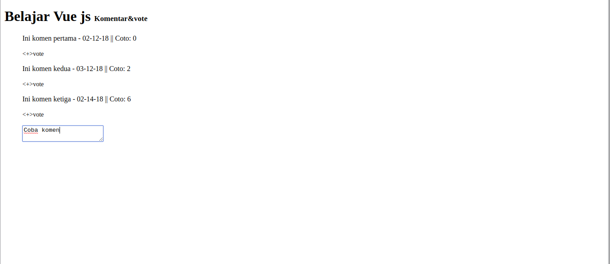
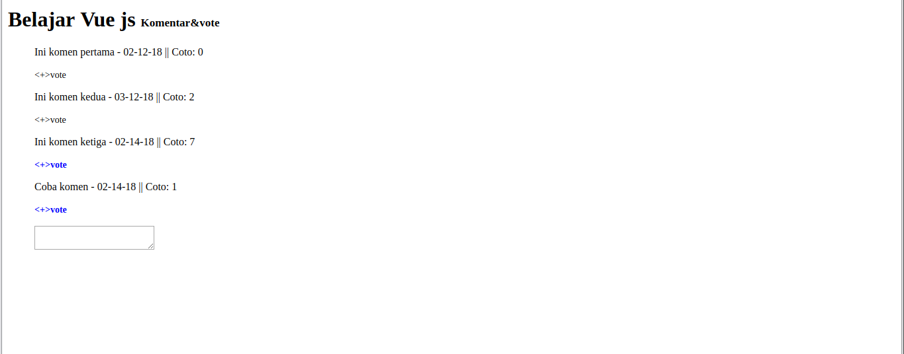

# Komentar vote
Membuat vote pada komentar menggunakan vue js 2

### Instalation
```
git clone https://github.com/linxcodev/komenvote-vue.git
```

### Pindah ke folder && Run In your server
```
cd komenvote-vue
```

### Penampakan


### Add Komentar


### vote


### Licence
MIT
